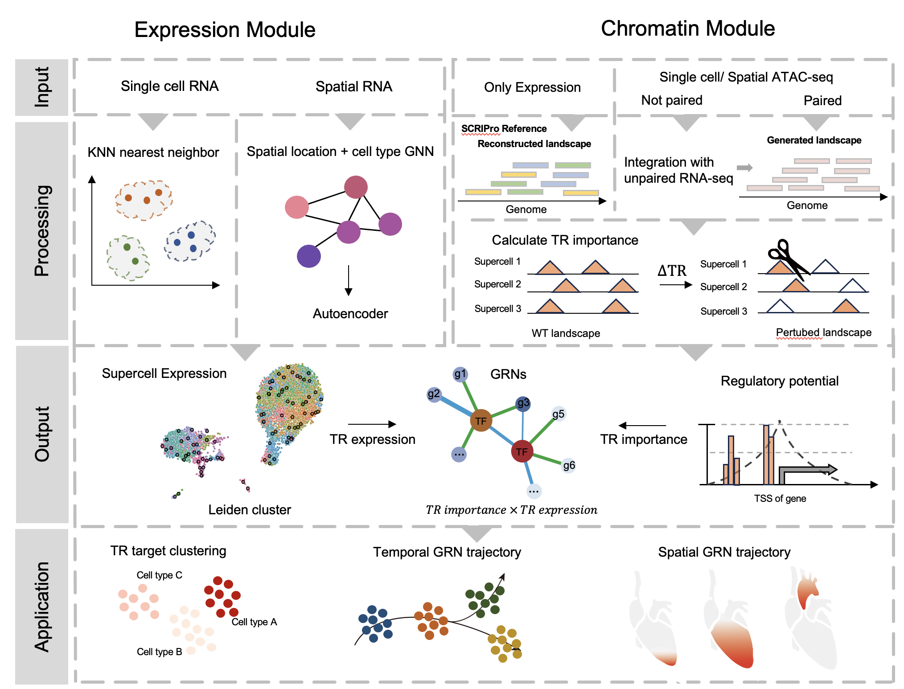

# SCRIPro

[](https://scripro.readthedocs.io/en/latest/?badge=latest)


The increasing availability of single-cell genomics data allows characterizing gene regulation networks (GRNs) at an unprecedented resolution. Previously we developed SCRIP, a computational method that integrates single-cell ATAC-seq data with a large-scale transcription regulator (TR) ChIP-seq data and motif reference for reconstructing single-cell TR activities and GRNs. Here, we present SCRIPro, an extended framework of SCRIP that suits both single-cell and spatial multi-ome data. SCRIPro first performed a density clustering based on expression and spatial similarity of the data to generate high coverage SuperCells. Next, SCRIPro performed in silico deletion analyses based on matched scATAC-seq or reconstructed chromatin landscapes from Cistrome accessibility data to evaluate the importance of TRs in regulating each SuperCell. Finally, SCRIPro combines the importance score of each TR with its gene expression using GRNBOOST2, which generates the TR-centered GRNs at Supercell resolution. We applied SCRIPro on human PBMC and human B-cell lymphoma scMulti-ome data, as well as mouse developing embryo spatial transcriptomic data, and demonstrated that SCRIPro is able to identify cell-type-specific TR regulations and show superior performance compared to conventional motif-based methods such as SCENIC+. Taken together, SCRIPro is a convenient and fast method that could reconstruct TR activities and GRNs for both single-cell and spatial multi-omic data.




## Installation
### Use the following commands to install Minicoda3：
``` bash
wget https://repo.continuum.io/miniconda/Miniconda3-latest-Linux-x86_64.sh
bash Miniconda3-latest-Linux-x86_64.sh
```
It is recommended to install scripro to a conda virtual environment:
~~~~
conda create -n scripro python=3.8
~~~~~

### Install SCRIPro from Github (developing version)
```bash
git clone git@github.com:xuyunfan9991/SCRIPro.git
cd SCRIPro
python setup.py install
```

### Install SCRIPro from Pypi
~~~~
pip install scripro
~~~~~


