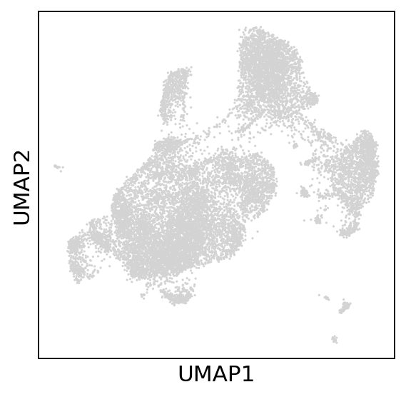
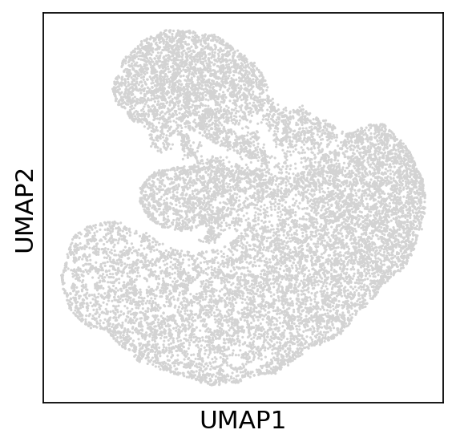
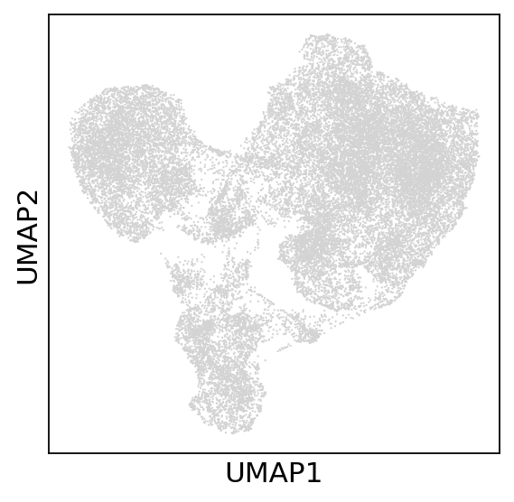
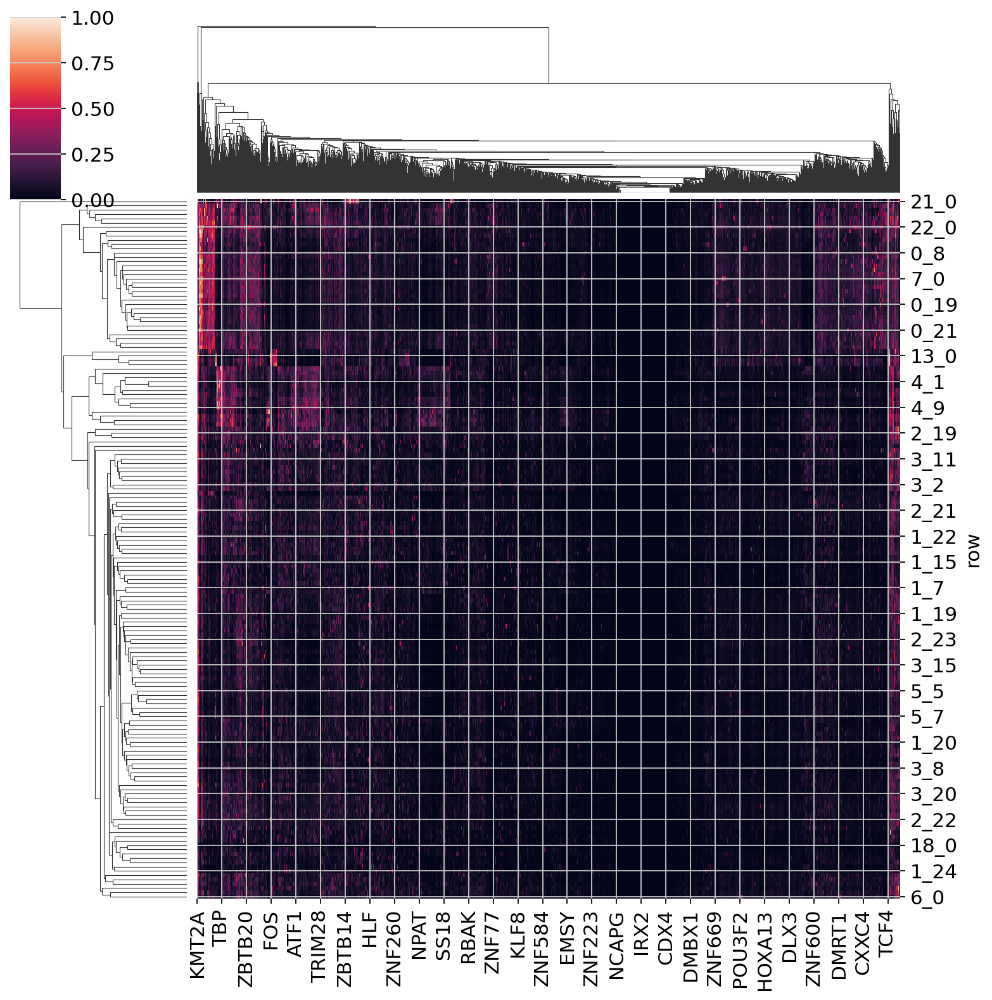

Multiome Workflow
=======================
Below is the workflow for SCRIPro's multi-omics data input, which requires paired/unpaired scRNA-seq and scATAC-seq data as input.

To demonstrate SCRIP's ability to be applied to Multi-omic data, we applied SCRIP to 10X Multiome-seq lymphoma sequencing data.Data are available on https://www.10xgenomics.com/datasets/fresh-frozen-lymph-node-with-b-cell-lymphoma-14-k-sorted-nuclei-1-standard-2-0 .

Using Shell: 
~~~~~~~~~~~~~~~~~~~~~~~~~~~~~~~~~~~~~~~

Transcription factor enrichment scores can be obtained by SCRIPro using the following shell statement:

.. code:: shell

    scripro enrich_multiome -i ./data/rna/rna.h5ad -n 50 -s hg38 -a matrix -b 0 -f ./data/atac/atac.h5ad -g./gencode.v43.chr_patch_hapl_scaff.annotation.gtf.gz -p multiome -t 12

========================   

Using Python for custom analysis:
~~~~~~~~~~~~~~~~~~~~~~~~~~~~~~~~~~~~~~~

.. code:: python

    import anndata as ad
    import networkx as nx
    import scanpy as sc
    import scglue
    from matplotlib import rcParams
    import numpy as np
    import scripro
    import pandas as pd
    import warnings
    import seaborn as sns
    from itertools import chain
    from scipy.spatial.distance import cdist
    warnings.filterwarnings("ignore")

Load data
---------

Respectively loaded ATAC-seq and RNA-seq data.

.. code:: python

    scglue.plot.set_publication_params()
    rcParams["figure.figsize"] = (4, 4)
    rna = sc.read_h5ad("/fs/home/xuyunfan/data/10x/lymph2/rna/rna.h5ad")
    rna.var_names_make_unique()
    rna.raw = rna
    atac = sc.read_h5ad('/fs/home/xuyunfan/data/10x/lymph2/atac/atac.h5ad')

Use GLUE to compute scATAC-matched scRNA barcodes
-------------------------------------------------

Here, we use GLUE to align the two omics data,here is the normal GLUE
workflow:

.. code:: python

    atac.var_names_make_unique()
    rna.layers["counts"] = rna.X.copy()
    sc.pp.normalize_total(rna, target_sum=1e4)
    sc.pp.log1p(rna)
    sc.pp.highly_variable_genes(rna, min_mean=0.0125, max_mean=3, min_disp=0.5)
    sc.pp.scale(rna)
    sc.tl.pca(rna, n_comps=100, svd_solver="auto")
    sc.pp.neighbors(rna, metric="cosine")
    sc.tl.umap(rna)
    sc.pl.umap(rna)

.. code:: python

    scglue.data.lsi(atac, n_components=5, n_iter=15)
    sc.pp.neighbors(atac, use_rep="X_lsi", metric="cosine")
    sc.tl.umap(atac)
    sc.pl.umap(atac)

.. code:: python

    scglue.data.get_gene_annotation(
        rna, gtf="../data/gencode.v43.chr_patch_hapl_scaff.annotation.gtf.gz",
        gtf_by="gene_name"
    )
    rna.var.loc[:, ["chrom", "chromStart", "chromEnd"]]

.. raw:: html

    

    
    <table border="1" class="dataframe">
      <thead>
        <tr style="text-align: right;">
          <th></th>
          <th>chrom</th>
          <th>chromStart</th>
          <th>chromEnd</th>
        </tr>
      </thead>
      <tbody>
        <tr>
          <th>MIR1302-2HG</th>
          <td>chr1</td>
          <td>29553.0</td>
          <td>31109.0</td>
        </tr>
        <tr>
          <th>FAM138A</th>
          <td>chr1</td>
          <td>34553.0</td>
          <td>36081.0</td>
        </tr>
        <tr>
          <th>OR4F5</th>
          <td>chr1</td>
          <td>65418.0</td>
          <td>71585.0</td>
        </tr>
        <tr>
          <th>AL627309.1</th>
          <td>NaN</td>
          <td>NaN</td>
          <td>NaN</td>
        </tr>
        <tr>
          <th>AL627309.3</th>
          <td>NaN</td>
          <td>NaN</td>
          <td>NaN</td>
        </tr>
        <tr>
          <th>...</th>
          <td>...</td>
          <td>...</td>
          <td>...</td>
        </tr>
        <tr>
          <th>AC141272.1</th>
          <td>NaN</td>
          <td>NaN</td>
          <td>NaN</td>
        </tr>
        <tr>
          <th>AC023491.2</th>
          <td>NaN</td>
          <td>NaN</td>
          <td>NaN</td>
        </tr>
        <tr>
          <th>AC007325.1</th>
          <td>NaN</td>
          <td>NaN</td>
          <td>NaN</td>
        </tr>
        <tr>
          <th>AC007325.4</th>
          <td>NaN</td>
          <td>NaN</td>
          <td>NaN</td>
        </tr>
        <tr>
          <th>AC007325.2</th>
          <td>NaN</td>
          <td>NaN</td>
          <td>NaN</td>
        </tr>
      </tbody>
    </table>
    
36621 rows × 3 columns

    

.. code:: python

    genes_to_remove = rna.var[~(rna.var.loc[:,"chromStart"]>0)].index
    rna = rna[:, ~rna.var.index.isin(genes_to_remove)]
    atac.var_names[:5]

.. parsed-literal::

    Index(['chr1_9795_10696', 'chr1_17061_17939', 'chr1_180997_181703',
           'chr1_183968_184757', 'chr1_186502_187406'],
          dtype='object')

.. code:: python

    split = atac.var_names.str.split(r"[_]")
    atac.var["chrom"] = split.map(lambda x: x[0])
    atac.var["chromStart"] = split.map(lambda x: x[1]).astype(int)
    atac.var["chromEnd"] = split.map(lambda x: x[2]).astype(int)
    atac.var.head()

.. raw:: html

    

    
    <table border="1" class="dataframe">
      <thead>
        <tr style="text-align: right;">
          <th></th>
          <th>chrom</th>
          <th>chromStart</th>
          <th>chromEnd</th>
        </tr>
      </thead>
      <tbody>
        <tr>
          <th>chr1_9795_10696</th>
          <td>chr1</td>
          <td>9795</td>
          <td>10696</td>
        </tr>
        <tr>
          <th>chr1_17061_17939</th>
          <td>chr1</td>
          <td>17061</td>
          <td>17939</td>
        </tr>
        <tr>
          <th>chr1_180997_181703</th>
          <td>chr1</td>
          <td>180997</td>
          <td>181703</td>
        </tr>
        <tr>
          <th>chr1_183968_184757</th>
          <td>chr1</td>
          <td>183968</td>
          <td>184757</td>
        </tr>
        <tr>
          <th>chr1_186502_187406</th>
          <td>chr1</td>
          <td>186502</td>
          <td>187406</td>
        </tr>
      </tbody>
    </table>
    

.. code:: python

    rna.var

.. raw:: html

    

    
    <table border="1" class="dataframe">
      <thead>
        <tr style="text-align: right;">
          <th></th>
          <th>highly_variable</th>
          <th>means</th>
          <th>dispersions</th>
          <th>dispersions_norm</th>
          <th>mean</th>
          <th>std</th>
          <th>chrom</th>
          <th>chromStart</th>
          <th>chromEnd</th>
          <th>name</th>
          <th>...</th>
          <th>itemRgb</th>
          <th>blockCount</th>
          <th>blockSizes</th>
          <th>blockStarts</th>
          <th>gene_id</th>
          <th>gene_type</th>
          <th>tag</th>
          <th>hgnc_id</th>
          <th>havana_gene</th>
          <th>artif_dupl</th>
        </tr>
      </thead>
      <tbody>
        <tr>
          <th>MIR1302-2HG</th>
          <td>False</td>
          <td>1.000000e-12</td>
          <td>NaN</td>
          <td>0.000000</td>
          <td>0.000000</td>
          <td>1.000000</td>
          <td>chr1</td>
          <td>29553.0</td>
          <td>31109.0</td>
          <td>MIR1302-2HG</td>
          <td>...</td>
          <td>.</td>
          <td>.</td>
          <td>.</td>
          <td>.</td>
          <td>ENSG00000243485.5</td>
          <td>lncRNA</td>
          <td>ncRNA_host</td>
          <td>HGNC:52482</td>
          <td>OTTHUMG00000000959.2</td>
          <td>NaN</td>
        </tr>
        <tr>
          <th>FAM138A</th>
          <td>False</td>
          <td>1.000000e-12</td>
          <td>NaN</td>
          <td>0.000000</td>
          <td>0.000000</td>
          <td>1.000000</td>
          <td>chr1</td>
          <td>34553.0</td>
          <td>36081.0</td>
          <td>FAM138A</td>
          <td>...</td>
          <td>.</td>
          <td>.</td>
          <td>.</td>
          <td>.</td>
          <td>ENSG00000237613.2</td>
          <td>lncRNA</td>
          <td>NaN</td>
          <td>HGNC:32334</td>
          <td>OTTHUMG00000000960.1</td>
          <td>NaN</td>
        </tr>
        <tr>
          <th>OR4F5</th>
          <td>False</td>
          <td>5.497313e-03</td>
          <td>1.040101</td>
          <td>-1.097506</td>
          <td>0.002889</td>
          <td>0.056353</td>
          <td>chr1</td>
          <td>65418.0</td>
          <td>71585.0</td>
          <td>OR4F5</td>
          <td>...</td>
          <td>.</td>
          <td>.</td>
          <td>.</td>
          <td>.</td>
          <td>ENSG00000186092.7</td>
          <td>protein_coding</td>
          <td>NaN</td>
          <td>HGNC:14825</td>
          <td>OTTHUMG00000001094.4</td>
          <td>NaN</td>
        </tr>
        <tr>
          <th>OR4F29</th>
          <td>False</td>
          <td>1.000000e-12</td>
          <td>NaN</td>
          <td>0.000000</td>
          <td>0.000000</td>
          <td>1.000000</td>
          <td>chr1</td>
          <td>450739.0</td>
          <td>451678.0</td>
          <td>OR4F29</td>
          <td>...</td>
          <td>.</td>
          <td>.</td>
          <td>.</td>
          <td>.</td>
          <td>ENSG00000284733.2</td>
          <td>protein_coding</td>
          <td>NaN</td>
          <td>HGNC:31275</td>
          <td>OTTHUMG00000002860.3</td>
          <td>NaN</td>
        </tr>
        <tr>
          <th>OR4F16</th>
          <td>False</td>
          <td>1.000000e-12</td>
          <td>NaN</td>
          <td>0.000000</td>
          <td>0.000000</td>
          <td>1.000000</td>
          <td>chr1</td>
          <td>685715.0</td>
          <td>686654.0</td>
          <td>OR4F16</td>
          <td>...</td>
          <td>.</td>
          <td>.</td>
          <td>.</td>
          <td>.</td>
          <td>ENSG00000284662.2</td>
          <td>protein_coding</td>
          <td>NaN</td>
          <td>HGNC:15079</td>
          <td>OTTHUMG00000002581.3</td>
          <td>NaN</td>
        </tr>
        <tr>
          <th>...</th>
          <td>...</td>
          <td>...</td>
          <td>...</td>
          <td>...</td>
          <td>...</td>
          <td>...</td>
          <td>...</td>
          <td>...</td>
          <td>...</td>
          <td>...</td>
          <td>...</td>
          <td>...</td>
          <td>...</td>
          <td>...</td>
          <td>...</td>
          <td>...</td>
          <td>...</td>
          <td>...</td>
          <td>...</td>
          <td>...</td>
          <td>...</td>
        </tr>
        <tr>
          <th>MT-ND4</th>
          <td>True</td>
          <td>2.037123e+00</td>
          <td>4.331923</td>
          <td>3.915107</td>
          <td>0.950185</td>
          <td>1.276617</td>
          <td>chrM</td>
          <td>10759.0</td>
          <td>12137.0</td>
          <td>MT-ND4</td>
          <td>...</td>
          <td>.</td>
          <td>.</td>
          <td>.</td>
          <td>.</td>
          <td>ENSG00000198886.2</td>
          <td>protein_coding</td>
          <td>NaN</td>
          <td>HGNC:7459</td>
          <td>NaN</td>
          <td>NaN</td>
        </tr>
        <tr>
          <th>MT-ND5</th>
          <td>True</td>
          <td>6.776105e-01</td>
          <td>3.704260</td>
          <td>5.513758</td>
          <td>0.219016</td>
          <td>0.636512</td>
          <td>chrM</td>
          <td>12336.0</td>
          <td>14148.0</td>
          <td>MT-ND5</td>
          <td>...</td>
          <td>.</td>
          <td>.</td>
          <td>.</td>
          <td>.</td>
          <td>ENSG00000198786.2</td>
          <td>protein_coding</td>
          <td>NaN</td>
          <td>HGNC:7461</td>
          <td>NaN</td>
          <td>NaN</td>
        </tr>
        <tr>
          <th>MT-ND6</th>
          <td>True</td>
          <td>2.098734e-01</td>
          <td>3.157219</td>
          <td>1.393144</td>
          <td>0.062790</td>
          <td>0.337936</td>
          <td>chrM</td>
          <td>14148.0</td>
          <td>14673.0</td>
          <td>MT-ND6</td>
          <td>...</td>
          <td>.</td>
          <td>.</td>
          <td>.</td>
          <td>.</td>
          <td>ENSG00000198695.2</td>
          <td>protein_coding</td>
          <td>NaN</td>
          <td>HGNC:7462</td>
          <td>NaN</td>
          <td>NaN</td>
        </tr>
        <tr>
          <th>MT-CYB</th>
          <td>True</td>
          <td>1.438881e+00</td>
          <td>4.125400</td>
          <td>4.742718</td>
          <td>0.554779</td>
          <td>1.015753</td>
          <td>chrM</td>
          <td>14746.0</td>
          <td>15887.0</td>
          <td>MT-CYB</td>
          <td>...</td>
          <td>.</td>
          <td>.</td>
          <td>.</td>
          <td>.</td>
          <td>ENSG00000198727.2</td>
          <td>protein_coding</td>
          <td>NaN</td>
          <td>HGNC:7427</td>
          <td>NaN</td>
          <td>NaN</td>
        </tr>
        <tr>
          <th>MAFIP</th>
          <td>False</td>
          <td>2.067433e-02</td>
          <td>1.815702</td>
          <td>-0.185062</td>
          <td>0.008163</td>
          <td>0.110646</td>
          <td>GL000194.1</td>
          <td>53593.0</td>
          <td>115055.0</td>
          <td>MAFIP</td>
          <td>...</td>
          <td>.</td>
          <td>.</td>
          <td>.</td>
          <td>.</td>
          <td>ENSG00000274847.1</td>
          <td>protein_coding</td>
          <td>NaN</td>
          <td>HGNC:31102</td>
          <td>NaN</td>
          <td>NaN</td>
        </tr>
      </tbody>
    </table>
    
23469 rows × 24 columns

    

.. code:: python

    guidance = scglue.genomics.rna_anchored_guidance_graph(rna, atac)
    guidance
    scglue.graph.check_graph(guidance, [rna, atac])
    scglue.models.configure_dataset(
        rna, "NB", use_highly_variable=True,
        use_layer="counts", use_rep="X_pca"
    )
    scglue.models.configure_dataset(
        atac, "NB", use_highly_variable=True,
        use_rep="X_lsi"
    )
    guidance_hvf = guidance.subgraph(chain(
        rna.var.query("highly_variable").index,
        atac.var.query("highly_variable").index
    )).copy()
    glue = scglue.models.fit_SCGLUE(
        {"rna": rna, "atac": atac}, guidance_hvf,
        fit_kws={"directory": "glue"}
    )
    dx = scglue.models.integration_consistency(
        glue, {"rna": rna, "atac": atac}, guidance_hvf
    )
    dx

.. raw:: html

    

    
    <table border="1" class="dataframe">
      <thead>
        <tr style="text-align: right;">
          <th></th>
          <th>n_meta</th>
          <th>consistency</th>
        </tr>
      </thead>
      <tbody>
        <tr>
          <th>0</th>
          <td>10</td>
          <td>0.320081</td>
        </tr>
        <tr>
          <th>1</th>
          <td>20</td>
          <td>0.281343</td>
        </tr>
        <tr>
          <th>2</th>
          <td>50</td>
          <td>0.216881</td>
        </tr>
        <tr>
          <th>3</th>
          <td>100</td>
          <td>0.169161</td>
        </tr>
        <tr>
          <th>4</th>
          <td>200</td>
          <td>0.136142</td>
        </tr>
      </tbody>
    </table>
    

.. code:: python

    _ = sns.lineplot(x="n_meta", y="consistency", data=dx).axhline(y=0.05, c="darkred", ls="--")

.. image:: Multiome_workflow_files/Multiome_workflow_32_0.png
   :width: 330px
   :height: 300px

.. code:: python

    rna.obsm["X_glue"] = glue.encode_data("rna", rna)
    atac.obsm["X_glue"] = glue.encode_data("atac", atac)
    rna

.. parsed-literal::

    AnnData object with n_obs × n_vars = 14566 × 23469
        obs: 'balancing_weight'
        var: 'highly_variable', 'means', 'dispersions', 'dispersions_norm', 'mean', 'std', 'chrom', 'chromStart', 'chromEnd', 'name', 'score', 'strand', 'thickStart', 'thickEnd', 'itemRgb', 'blockCount', 'blockSizes', 'blockStarts', 'gene_id', 'gene_type', 'tag', 'hgnc_id', 'havana_gene', 'artif_dupl'
        uns: 'log1p', 'hvg', 'pca', 'neighbors', 'umap', '__scglue__'
        obsm: 'X_pca', 'X_umap', 'X_glue'
        varm: 'PCs'
        layers: 'counts'
        obsp: 'distances', 'connectivities'

.. code:: python

    atac

.. parsed-literal::

    AnnData object with n_obs × n_vars = 14566 × 109789
        obs: 'balancing_weight'
        var: 'chrom', 'chromStart', 'chromEnd', 'highly_variable'
        uns: 'neighbors', 'umap', '__scglue__'
        obsm: 'X_lsi', 'X_umap', 'X_glue'
        obsp: 'distances', 'connectivities'

.. code:: python

    rna.obs['feature']='rna'
    atac.obs['feature']='atac'
    combined = ad.concat([rna, atac])
    combined

.. parsed-literal::

    AnnData object with n_obs × n_vars = 29132 × 0
        obs: 'balancing_weight', 'feature'
        obsm: 'X_umap', 'X_glue'

.. code:: python

    sc.pp.neighbors(combined, use_rep="X_glue", metric="cosine")
    sc.tl.umap(combined)
    sc.pl.umap(combined)

.. code:: python

    sc.tl.leiden(combined,resolution=0.8)
    sc.pl.umap(combined,color='leiden')

.. image:: Multiome_workflow_files/Multiome_workflow_42_0.png
   :width: 393px
   :height: 296px

.. code:: python

    combined

.. parsed-literal::

    AnnData object with n_obs × n_vars = 29132 × 0
        obs: 'balancing_weight', 'feature', 'leiden'
        uns: 'neighbors', 'umap', 'leiden', 'leiden_colors'
        obsm: 'X_umap', 'X_glue'
        obsp: 'distances', 'connectivities'

.. code:: python

    combined_rna = combined[combined.obs.feature == 'rna']
    combined_rna

.. parsed-literal::

    View of AnnData object with n_obs × n_vars = 14566 × 0
        obs: 'balancing_weight', 'feature', 'leiden'
        uns: 'neighbors', 'umap', 'leiden', 'leiden_colors'
        obsm: 'X_umap', 'X_glue'
        obsp: 'distances', 'connectivities'

.. code:: python

    combined_rna.obs

.. raw:: html

    

    
    <table border="1" class="dataframe">
      <thead>
        <tr style="text-align: right;">
          <th></th>
          <th>balancing_weight</th>
          <th>feature</th>
          <th>leiden</th>
        </tr>
      </thead>
      <tbody>
        <tr>
          <th>AAACAGCCAGAACCGA-1</th>
          <td>0.766128</td>
          <td>rna</td>
          <td>0</td>
        </tr>
        <tr>
          <th>AAACAGCCAGCCTAAC-1</th>
          <td>3.160764</td>
          <td>rna</td>
          <td>1</td>
        </tr>
        <tr>
          <th>AAACAGCCATATTGAC-1</th>
          <td>1.073027</td>
          <td>rna</td>
          <td>4</td>
        </tr>
        <tr>
          <th>AAACATGCAAATTCGT-1</th>
          <td>1.073027</td>
          <td>rna</td>
          <td>4</td>
        </tr>
        <tr>
          <th>AAACATGCAACCTAAT-1</th>
          <td>0.660823</td>
          <td>rna</td>
          <td>9</td>
        </tr>
        <tr>
          <th>...</th>
          <td>...</td>
          <td>...</td>
          <td>...</td>
        </tr>
        <tr>
          <th>TTTGTTGGTATGGTGC-1</th>
          <td>0.432174</td>
          <td>rna</td>
          <td>12</td>
        </tr>
        <tr>
          <th>TTTGTTGGTCAATACG-1</th>
          <td>1.097787</td>
          <td>rna</td>
          <td>3</td>
        </tr>
        <tr>
          <th>TTTGTTGGTCAGGAAG-1</th>
          <td>0.687277</td>
          <td>rna</td>
          <td>1</td>
        </tr>
        <tr>
          <th>TTTGTTGGTTCAAGAT-1</th>
          <td>1.884496</td>
          <td>rna</td>
          <td>6</td>
        </tr>
        <tr>
          <th>TTTGTTGGTTTACTTG-1</th>
          <td>0.687277</td>
          <td>rna</td>
          <td>1</td>
        </tr>
      </tbody>
    </table>
    
14566 rows × 3 columns

    

.. code:: python

    combined_rna.obs.loc[:,'new_leiden'] = np.nan
    scripro.glue_metacell(combined_rna,50)
    rna_leiden_clusters = combined_rna.obs['new_leiden']
    rna_leiden_clusters

.. parsed-literal::

    AAACAGCCAGAACCGA-1     0_1
    AAACAGCCAGCCTAAC-1     1_4
    AAACAGCCATATTGAC-1     4_0
    AAACATGCAAATTCGT-1     4_0
    AAACATGCAACCTAAT-1     9_0
                          ... 
    TTTGTTGGTATGGTGC-1    12_0
    TTTGTTGGTCAATACG-1     3_6
    TTTGTTGGTCAGGAAG-1    1_25
    TTTGTTGGTTCAAGAT-1     6_0
    TTTGTTGGTTTACTTG-1    1_29
    Name: new_leiden, Length: 14566, dtype: object

The RNA-Seq and ATAC-seq omics data are combined to generate a new
dataset Combined, then divide metacell using the RNA-seq data region,
and assign the corresponding metacell to the corresponding ATAC-seq
data.

.. code:: python

    combined_atac = combined[combined.obs.feature == 'atac']
    distance_matrix = cdist(combined_atac.obsm['X_umap'], combined_rna.obsm['X_umap'], metric='euclidean')
    nearest_rna = np.argmin(distance_matrix, axis=1)
    nearest_rna

.. parsed-literal::

    array([ 1836,  9072,  1954, ..., 13302,  8738, 12567])

.. code:: python

    atac_leiden_clusters = rna_leiden_clusters[nearest_rna]
    atac_leiden_clusters.index = combined_atac.obs.index
    rna.obs = combined_rna.obs
    cellgroup = pd.DataFrame(atac_leiden_clusters)
    cellgroup 

.. raw:: html

    

    
    <table border="1" class="dataframe">
      <thead>
        <tr style="text-align: right;">
          <th></th>
          <th>new_leiden</th>
        </tr>
      </thead>
      <tbody>
        <tr>
          <th>AAACAGCCAGAACCGA-1</th>
          <td>0_4</td>
        </tr>
        <tr>
          <th>AAACAGCCAGCCTAAC-1</th>
          <td>8_0</td>
        </tr>
        <tr>
          <th>AAACAGCCATATTGAC-1</th>
          <td>15_0</td>
        </tr>
        <tr>
          <th>AAACATGCAAATTCGT-1</th>
          <td>4_1</td>
        </tr>
        <tr>
          <th>AAACATGCAACCTAAT-1</th>
          <td>9_0</td>
        </tr>
        <tr>
          <th>...</th>
          <td>...</td>
        </tr>
        <tr>
          <th>TTTGTTGGTATGGTGC-1</th>
          <td>12_0</td>
        </tr>
        <tr>
          <th>TTTGTTGGTCAATACG-1</th>
          <td>1_17</td>
        </tr>
        <tr>
          <th>TTTGTTGGTCAGGAAG-1</th>
          <td>18_0</td>
        </tr>
        <tr>
          <th>TTTGTTGGTTCAAGAT-1</th>
          <td>6_0</td>
        </tr>
        <tr>
          <th>TTTGTTGGTTTACTTG-1</th>
          <td>1_19</td>
        </tr>
      </tbody>
    </table>
    
14566 rows × 1 columns

    

Calculate metacell and markergene
----------------------------------

.. code:: python

    test_data = scripro.Ori_Data(rna,Cell_num=50,use_glue = True)
    test_data.get_glue_cluster(rna_leiden_clusters)
    test_data.get_positive_marker_gene_parallel()

The data from ATAC-seq is used to generate the corresponding chromatin
landscape, that is the bigwig file corresponding to metacell of the
same name, which is stored in the folder ‘./bigwig’.

.. code:: python

    scripro.dataframe_to_sparse_tsv(atac.to_df(), 'test.tsv')
    scripro.get_metacell_fragment(cellgroup,'.','./test.tsv',chunksize = 10000000)
    scripro.process_tsv('./metacell_fragment/', 'hg38')
    share_seq_data = scripro.SCRIPro_Multiome(8,'hg38',test_data)

Calculate the TF activity score
-------------------------------

.. code:: python

    share_seq_data.cal_ISD_parallel('./bigwig/')
    share_seq_data.get_tf_score()
    sns.clustermap(share_seq_data.tf_score)

