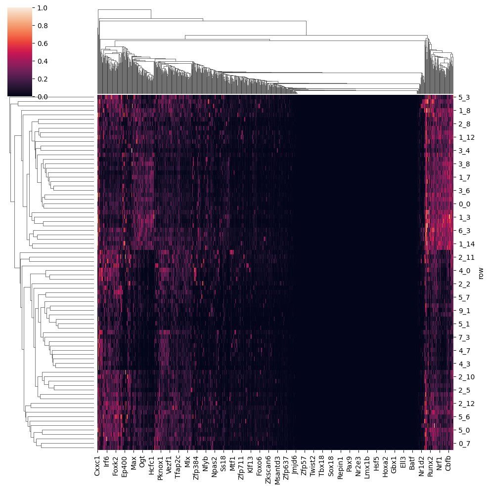
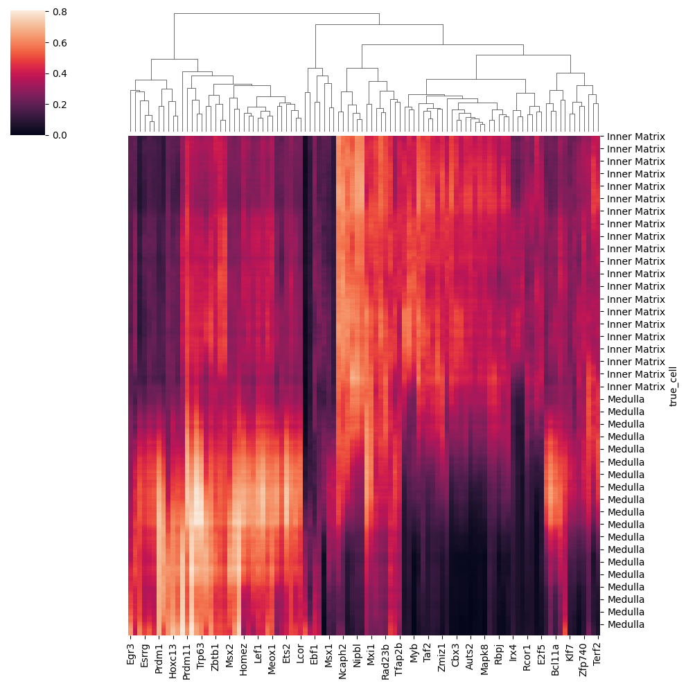
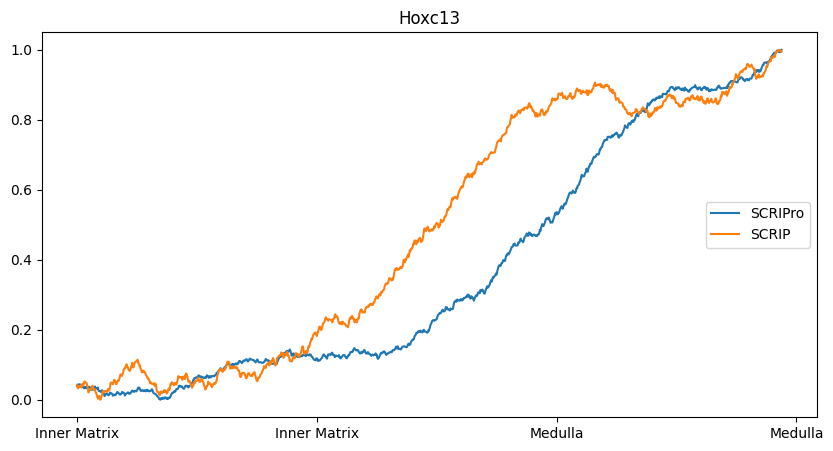

Trajectory & ATAC Only Workflow
===============================

To test the ability of SCRIPro to apply to continuously differentiated datasets, we applied it to SHARE-seq sequenced mouse hair follicle development data (which can be downloaded from https://www.ncbi.nlm.nih.gov/geo/query/acc.cgi?acc=GSE140203), where transcriptome and epigenome data were used to infer transcription factor enrichment scores, respectively, and examine the spatio-temporal heterogeneity of transcription factor function.

Transcription factor enrichment scores can be obtained by SCRIPro using the following shell statement:

.. code:: ipython3

    scripro enrich_multiome -i ./data/rna/trajectory.h5ad -n 50 -s mm10 -a matrix -b 1 -f ./data/atac/trajectory.h5ad -g ./gencode.vM25.annotation.gtf.gz -p  Trajectory -t 12

Transcription factor enrichment scores can be obtained by SCRIP using the following shell statement:

.. code:: ipython3

    scripro enrich_atac enrich -i ./data/atac/trajectory.h5ad -s mm -p Trajectory  -t 12

.. code:: ipython3

    import scripro
    import scglue
    import anndata
    import matplotlib.pyplot as plt
    import numpy as np
    import seaborn as sns
    import pandas as pd
    import scanpy as sc
    import warnings
    warnings.filterwarnings("ignore")

Load data
---------

Load the scRNA-seq data and scATAC-seq data, as well as the SCRIP
calculated TF score

.. code:: ipython3

    miradata = anndata.read_h5ad('/fs/home/xuyunfan/project/scripmulti/mira/trajectory.h5ad')
    scrip = pd.read_csv('/fs/home/xuyunfan/data/mira/gse/atac/Mouse/enrichment/SCRIP_enrichment.txt',sep='\t',index_col=0)
    atac = sc.read_h5ad('/fs/home/xuyunfan/project/scripmulti/mira/atac_scrip.h5ad')
    rna = sc.read_h5ad("/fs/home/xuyunfan/data/mira/shareseq_base_data/rna_data.h5ad")
    select_cell = list(set(miradata.to_df().index).intersection(scrip.index).intersection(atac.to_df().index).intersection(rna.to_df().index))
    miradata = miradata[select_cell]
    atac =  atac[select_cell]
    atac_df=atac.to_df()
    rna =rna[select_cell]
    rna.var_names_make_unique()
    rna.var_names = [x.capitalize() for x in rna.var_names]

Calculate Supercell and markergene
----------------------------------

.. code:: ipython3

    test_data = scripro.Ori_Data(rna,Cell_num=50)
    test_data.get_positive_marker_gene_parallel(cores=4)
    cellgroup = test_data.adata.obs.loc[:,['new_leiden']]
    sc.get.rank_genes_groups_df(test_data.adata, group='0_0', log2fc_min=0.5, pval_cutoff=0.1)

.. raw:: html

    

    
    <table border="1" class="dataframe">
      <thead>
        <tr style="text-align: right;">
          <th></th>
          <th>names</th>
          <th>scores</th>
          <th>logfoldchanges</th>
          <th>pvals</th>
          <th>pvals_adj</th>
        </tr>
      </thead>
      <tbody>
        <tr>
          <th>0</th>
          <td>Robo1</td>
          <td>33.262318</td>
          <td>3.100753</td>
          <td>2.210608e-70</td>
          <td>8.281822e-67</td>
        </tr>
        <tr>
          <th>1</th>
          <td>Sox5</td>
          <td>31.031414</td>
          <td>4.105570</td>
          <td>9.752101e-62</td>
          <td>2.283454e-58</td>
        </tr>
        <tr>
          <th>2</th>
          <td>Cux1</td>
          <td>30.107073</td>
          <td>2.690581</td>
          <td>3.416571e-65</td>
          <td>9.142745e-62</td>
        </tr>
        <tr>
          <th>3</th>
          <td>Eda</td>
          <td>21.409723</td>
          <td>3.492702</td>
          <td>2.632037e-43</td>
          <td>2.900195e-40</td>
        </tr>
        <tr>
          <th>4</th>
          <td>Nfib</td>
          <td>18.497385</td>
          <td>2.344622</td>
          <td>3.836717e-38</td>
          <td>2.994558e-35</td>
        </tr>
        <tr>
          <th>...</th>
          <td>...</td>
          <td>...</td>
          <td>...</td>
          <td>...</td>
          <td>...</td>
        </tr>
        <tr>
          <th>1902</th>
          <td>Ddx27</td>
          <td>2.153615</td>
          <td>0.978330</td>
          <td>3.330264e-02</td>
          <td>9.880031e-02</td>
        </tr>
        <tr>
          <th>1903</th>
          <td>Tmc7</td>
          <td>2.153065</td>
          <td>2.035018</td>
          <td>3.337731e-02</td>
          <td>9.899046e-02</td>
        </tr>
        <tr>
          <th>1904</th>
          <td>9930021j03rik</td>
          <td>2.152729</td>
          <td>0.765872</td>
          <td>3.336331e-02</td>
          <td>9.896460e-02</td>
        </tr>
        <tr>
          <th>1905</th>
          <td>Psmb1</td>
          <td>2.151586</td>
          <td>0.917678</td>
          <td>3.346546e-02</td>
          <td>9.920478e-02</td>
        </tr>
        <tr>
          <th>1906</th>
          <td>Mta1</td>
          <td>2.149554</td>
          <td>1.004966</td>
          <td>3.362917e-02</td>
          <td>9.961127e-02</td>
        </tr>
      </tbody>
    </table>
    
1907 rows × 5 columns

    

.. code:: ipython3

    test_data.adata.obs

.. raw:: html

    

    
    <table border="1" class="dataframe">
      <thead>
        <tr style="text-align: right;">
          <th></th>
          <th>n_genes</th>
          <th>celltype</th>
          <th>true_cell</th>
          <th>leiden</th>
          <th>new_leiden</th>
        </tr>
        <tr>
          <th>barcode</th>
          <th></th>
          <th></th>
          <th></th>
          <th></th>
          <th></th>
        </tr>
      </thead>
      <tbody>
        <tr>
          <th>R1.04.R2.48.R3.50.P1.55</th>
          <td>672</td>
          <td>Medulla</td>
          <td>Medulla</td>
          <td>4</td>
          <td>4_1</td>
        </tr>
        <tr>
          <th>R1.36.R2.51.R3.11.P1.55</th>
          <td>582</td>
          <td>TAC-1</td>
          <td>Cortex</td>
          <td>1</td>
          <td>1_0</td>
        </tr>
        <tr>
          <th>R1.56.R2.29.R3.61.P1.53</th>
          <td>838</td>
          <td>Mix</td>
          <td>Matrix</td>
          <td>0</td>
          <td>0_17</td>
        </tr>
        <tr>
          <th>R1.03.R2.55.R3.02.P1.54</th>
          <td>609</td>
          <td>TAC-1</td>
          <td>Cortex</td>
          <td>1</td>
          <td>1_2</td>
        </tr>
        <tr>
          <th>R1.72.R2.16.R3.44.P1.55</th>
          <td>751</td>
          <td>Hair Shaft-cuticle.cortex</td>
          <td>Cortex</td>
          <td>1</td>
          <td>1_7</td>
        </tr>
        <tr>
          <th>...</th>
          <td>...</td>
          <td>...</td>
          <td>...</td>
          <td>...</td>
          <td>...</td>
        </tr>
        <tr>
          <th>R1.59.R2.20.R3.84.P1.56</th>
          <td>959</td>
          <td>IRS</td>
          <td>IRS</td>
          <td>2</td>
          <td>2_9</td>
        </tr>
        <tr>
          <th>R1.45.R2.04.R3.35.P1.55</th>
          <td>535</td>
          <td>TAC-2</td>
          <td>Inner Matrix</td>
          <td>6</td>
          <td>6_0</td>
        </tr>
        <tr>
          <th>R1.02.R2.75.R3.29.P1.55</th>
          <td>451</td>
          <td>TAC-1</td>
          <td>Medulla</td>
          <td>1</td>
          <td>1_6</td>
        </tr>
        <tr>
          <th>R1.72.R2.70.R3.69.P1.55</th>
          <td>623</td>
          <td>TAC-1</td>
          <td>Matrix</td>
          <td>0</td>
          <td>0_9</td>
        </tr>
        <tr>
          <th>R1.59.R2.21.R3.81.P1.56</th>
          <td>1554</td>
          <td>Hair Shaft-cuticle.cortex</td>
          <td>Cortex</td>
          <td>1</td>
          <td>1_5</td>
        </tr>
      </tbody>
    </table>
    
6243 rows × 5 columns

    

Calculate the landscape of supercell
------------------------------------

.. code:: ipython3

    scripro.dataframe_to_sparse_tsv(atac_df, 'test.tsv')
    scripro.get_supercell_fragment(cellgroup,'.','./test.tsv',chunksize = 10000000)
    scripro.process_tsv('./supercell_fragment/', 'mm10')
    share_seq_data = scripro.SCRIPro_Multiome(8,'mm10',test_data)

Calculate the TF activity score
-------------------------------

.. code:: ipython3

    share_seq_data.cal_ISD_parallel('./bigwig/')
    share_seq_data.get_tf_score()
    sns.clustermap(share_seq_data.tf_score)

Calculate the TF activity score corresponding to pesudotime
-----------------------------------------------------------

.. code:: ipython3

    trajectory_data = sc.read_h5ad('/fs/home/xuyunfan/project/SCRIPro/package/trajectory.h5ad')
    all_pro_score = pd.merge(test_data.adata.obs,share_seq_data.tf_score,left_on='new_leiden',right_index=True)
    all_pro_score=all_pro_score.iloc[:,5:]
    trajectory_data = trajectory_data[select_cell2]
    all_pro_score =all_pro_score.loc[trajectory_data.obs.index,:]
    all_anndata= sc.AnnData(all_pro_score)
    all_anndata.obsm = trajectory_data.obsm
    sc.pl.umap(all_anndata,color = 'Prdm1')

.. image:: Trajectory_workflow_files/Trajectory_workflow_36_0.png

Calculate the difference between the SCRIPro and SCRIP scores corresponding to ORS-Medulla
------------------------------------------------------------------------------------------

.. code:: ipython3

    select_cell2 = list(set(select_cell).intersection(all_pro_score.index))
    scrip = (scrip - scrip.min())/(scrip.max()-scrip.min())
    scrip = scrip.loc[select_cell2,:]
    tra = trajectory_data.obs
    Medulla_tra = tra[tra['Medulla_prob'] >0.25].sort_values(by = 'Medulla_prob').index
    Medulla_score =all_pro_score.loc[Medulla_tra,:]
    Medulla_score.index = Medulla_score['true_cell']
    Medulla_score =Medulla_score.iloc[:,5:]
    Medulla_score = (Medulla_score - Medulla_score.min())/(Medulla_score.max() - Medulla_score.min())
    sns.clustermap(Medulla_score.loc[:,Medulla_score.std().sort_values(ascending = False)[0:100].index].rolling(window=100).mean().iloc[100:,:],row_cluster=False)

.. code:: ipython3

    plt.figure(figsize=(10, 5))
    TF = 'Hoxc13'
    data_series1=pd.Series(list(Medulla_score.loc[:,TF]))
    smooth_data1 = data_series1.rolling(window=200).mean()
    smooth_data1 = (smooth_data1 - smooth_data1.min())/(smooth_data1.max() - smooth_data1.min())
    plt.plot(smooth_data1[200:].reset_index(drop = True), label='SCRIPro')
    
    data_series2=pd.Series(list(scrip.loc[Medulla_tra,TF]))
    smooth_data2 = data_series2.rolling(window=200).mean()
    smooth_data2 = (smooth_data2 - smooth_data2.min())/(smooth_data2.max() - smooth_data2.min())
    plt.plot(smooth_data2[200:].reset_index(drop = True), label='SCRIP')
    
    # set xticks every 200 steps
    xticks_locs = np.arange(0, len(Medulla_score.index), 400)
    plt.xticks(xticks_locs, Medulla_score.index[xticks_locs])
    plt.title(TF)
    plt.legend(loc='right')
    
    
    plt.show()

